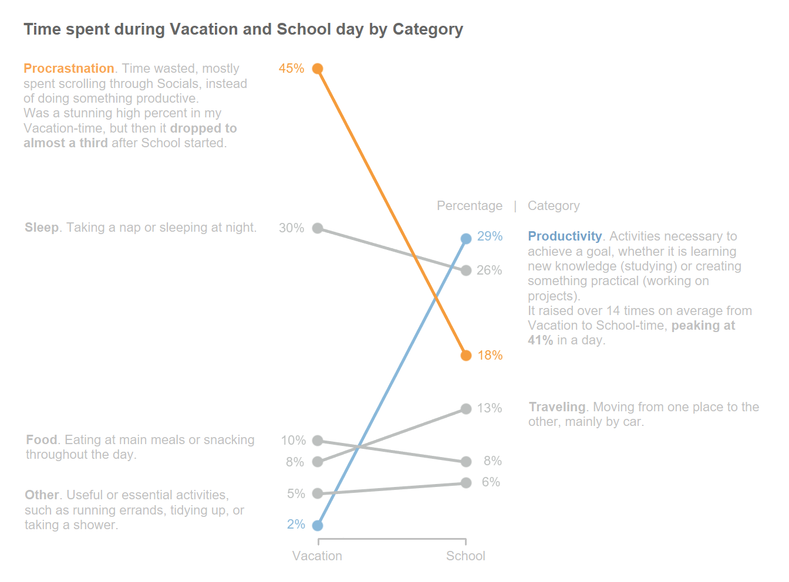

# Vacation-vs-School

[Link to Tableau Public](https://public.tableau.com/views/TimepctVacation-School/TimespentduringVacationandSchooldaybyCategory?:language=it-IT&:display_count=n&:origin=viz_share_link)


## Introduction
As a university student, the transition between the _Vacation_ time and the _School_ brings about major changes in how I spend my time. With an increased workload and new goals to achieve, the time I spend on various activities changes.\
On a personal level, I am interested in understanding how my days have actually changed from before and after School, quantifying how much _productive_ activities have increased, whether _procrastination_ has decreased, and whether the change of period affects other factors such as _sleep_ or time spent _eating_.


## Data
I personally collected the data in the past month. Each record is composed of the following variables:
- Date
- Starting Time
- Title of the Action
- Category, between
	1. Productivity
	2. Passive (procrastination)
	3. Food
	4. Sleeping
	5. Travelling
	6. Other

I used two different methods to collect the data.\
In the first few days, I simply collected the data in the **Google Keep** app. Then, I transferred the data to **Google Sheets**, from where I created a simple **Appsheet** application based on that same spreadsheet.


## Analyzing the Data
### On Google Sheets
A calculated variable that will simplify the analysis is the `Duration` of each individual action. To calculate it, I first extracted a column called `Minutes`
```excel
=HOUR(SUBSTITUTE(C2,":","."))*60+MINUTE(SUBSTITUTE(C2,":","."))+1440*(DAY(B2)-16)
```
where:
- column B: Date
- column C: Hour
Then, the `Duration` column is created by subtracting the current `Minutes` value from the next one.
```excel
=F3-F2
```
where F is the column `Minutes`.

### On Google Colab
\
[_Link to Python Notebook_](scripts/Tracking_Day.ipynb)\
\
The data analysis was performed in _Google Colab_. After connecting _Google Sheets_ and adjusting the data types, the actions were distinguished between vacation and school in a new variable called `Phase`.\
Thanks to this distinction, it is possible to calculate the main statistics by grouping by `Phase` and `Category`.


## Results
From the analysis performed with Python, we can plot the resulting table in a Slope Chart (made with Tableau).\
\
As expected, _procrastination_ has decreased in favor of more _productive activities_. The time spent on other activities has not changed much, remaining within a 5% range of deviation on an average day.
